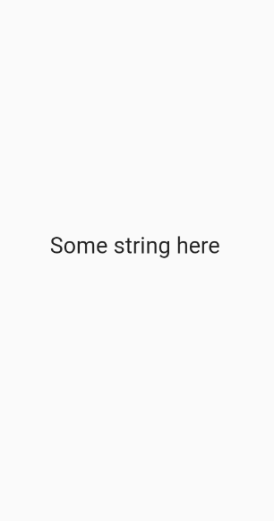

# Flutter

# Introduction
Flutter is a powerful and intuitive framework for building beautiful, cross-platform mobile applications that uses the Dart programming language.

This essentially means that Flutter can be used to write one codebase for an app that runs natively on both iOS and Android.

Learning Flutter is both a valuable skill and a gratifying endeavor in its own right. However, the path to learning Flutter is a little unclear due to how new the language is.
- the language is constantly being updated (to the point where tutorials from just a few months ago are out of date)
- there are a lack of freely available, well thought out and comprehensive courses or books compared to some other more established frameworks and languages like python

[What makes Flutter different for app development?](https://www.youtube.com/watch?v=l-YO9CmaSUM)
# Setting Up for Flutter Development
* [Getting Started: Installing Flutter](https://docs.flutter.dev/get-started/install)
* [Git for Windows](https://git-scm.com/downloads)
* [Install Android Studio](https://developer.android.com/studio)\

Once finished, run this command in the terminal to make sure your environment is all ready to go.
```flutter
$ flutter doctor
```
# Learning Dart

Dart is a language developed by Google that is the backbone to the flutter framework. It is the language you will be using when you code up apps with the Flutter framework.
- [Dart Programming in 4 hours | Full beginners tutorial](https://youtu.be/5xlVP04905w)


### Hello World
Every app has a `main()` function. To display text on the console, you can use the top-level `print()` function:
```dart
void main() {
  print('Hello, World!');
}
```
### Variables

Variables in dart are type-checked, which means that every variable must be declared with a specific type, and that type must match with what the variable is assigned throughout your programs.

Here are some basic types and examples:

```dart
String foo = 'foo';
int bar = 0;
double foobar= 12.454;
bool isCool = true;
List<String> foobarList = ['foo', 'bar'];
```

Dictionaries (which map keys to values) are specificed as the 'Map' type in dart. You have to specify the key type and the value type, like as follows.

```dart
Map<String, int> grades = {
  'John': 99,
  'Doe': 30,
};
```

You will get an error if you assign an incompatible type to the same variable.
    
```dart
String errorExample = 'foo';
errorExample = 2; // ERROR
```
    
You can use 'var' and 'dynamic' to make a variable type dynamic, but it is usually not a good idea to do this, as it could end up in frustrating errors down the line.

Additionally, dart has a unique 'final' and 'const' operator that can be used for declaring variables. 'final' is generally used to declare a variable that won't change once it's declared. For example, if a user types in their name and we save it to a variable, we know that variable (their name) won't change, so we can initialize / declare it like so:

```dart
final String name;
```

The 'const' keyword is a little more of a specific use case - it makes the variable constant from compile-time only. It will be useful later down the line for the Flutter framework.

    
### Functions

Functions are declared by specifying the return type, the name of the function, and the parameters within paranetheses. Void is used to specify the return type if nothing is returned. 

```dart
// doesn't return anything but still executes some code
void main() {
  print('hello world');
}

// prints 'hello' but also returns the string 'complete'
String hello(int reps) {
  for (int i = 0; i < reps; i++) {
    print('hello');
  }
  return 'complete';
}

// returns a list of strings (List<String>)
List<String> people() {
  return ['John', 'Doe'];
}
```

Asynchronous functions are functions that can execute different commands at the same time - asynchronously. 

An example of how this would be useful is in calling APIs (basically, trying to retrieve some sort of useful information or data that was programmed by someone else, from the web). If our function calls an API and assigns a variable to the API's response, but our entire App is waiting for that function to finish executing in order to do something, then it isn't very efficient. If we make this function asynchronous, the function calling the API can then execute at the same time that the App allows other functions to execute, or while the App does something else.

Within an asynchronous function, if we ever need our function to wait for some line of code to finish before we continue, we simply precede the code with the keyword, 'await'.
    
For asynchronous functions in dart, add the 'async' keyword between the parentheses and the curly braces, and enclose the return type in 'Future<[return type]>'.

```dart
Future<String> retrieveData() async {
  String response = await someAPICall(); // assuming the api call returns a string
  return response;
}
```

### Conditionals

If statements are simply written as follows:

```dart
bool someCondition = true;

if (someCondition) {
  print('someCondition is true');
} else {
  print('someCondition is false');
}
```

### Loops

For loops are very important in all programming languages, and there are a few ways to implement them in dart.

```dart
List words = ['hello', 'world', '!'];

// 1st way
// declare an int i, increment it by 1 until it is no longer 
// less than words.length (3 in this case)
for (int i = 0; i < words.length; i++) {
  print(words[i]);
} 

// 2nd way
// for each element in word, dart will take that element (in this case, a string, word)
// and will allow you to execute code using that element (here, we just print it out)
// the rocket notation (=>) allows us to write only a single statement to execute
// on the right side. otherwise, we would do (word) { print('hey!'); print(word); }
words.forEach((word) => print(word));

// 3rd way
// very similar to the 2nd way but a different syntax
for (String word in words) {
  print(word);
}
```
### Classes, Objects, and Constructors

Classes are essentially blueprints, or templates, for creating your own data type in your programs. For example, if you wanted to write programs about cars, it would be very difficult to do so using the primitive data types of String, int, bool, etc. 

Using classes, we can create our own data types or models by defining a class, and its attributes. These attributes are of primitive data types, but the resulting class allows us to write more complex code in a simpler manner.

When we need to create a specific instance of a class (i.e. we want to use the blueprint to actually create a car), we 'instantiate' it with the attributes we want, and the result is called an Object. 

An object is simply a specific instance of a class - the class would be 'Car', and the object would be something like a Tesla Model S. Another object you might create would be a Lamborghini Aventador. You can create as many objects as you want using the same class!

Classes can be created and used like this. Notice how the type of the object that is instantiated is declared, and how the object is instantiated.

```dart
class Car {
  String name;
  int price;
  bool isMadeByElonMusk;
}

void main() {
  // type 'Car'
  Car tesla = Car(); // class is instantiated with parentheses, ()
  // populating each of the attributes we defined in the above class
  tesla.name = 'Model S';
  tesla.price = 50000;
  tesla.isMadeByElonMusk = true;
}
```

Now, it would be very tedious and inefficient to manually set all the attributes of an object after we've created one. Doing tesla.name, tesla.price, ..., isn't good enough for us.

That's where constructors come in. Constructors allow us to define a function in our class that will deal with setting all the attributes for us. Then, to instantiate a class, all we have to do is pass in the parameters. See the example below.

Another important concept relating to classes is methods.

Methods are functions defined in our class, that deal with data and perform special operations relating to our class. For example, we might want to check whether or not our car is expensive. We can do so by defining an 'isExpensive()' method inside our class. 

Note that methods defined within a certain class have access to the attributes associated with the object it was called upon. If the 'isExpensive()' method is called upon our tesla object, it has access to the tesla.price value.

```dart
// define a class named car
class Car {
  // define a constructor that takes in a String name, int price and bool isMadeByElonMusk
  Car(String name, int price, bool isMadeByElonMusk) {
    // set all the object's attributes equal to the inputs passed in
    this.name = name;
    this.price = price;
    this.isMadeByElonMusk = isMadeByElonMusk;
  }
  // defining the attributes of the class
  String name;
  int price;
  bool isMadeByElonMusk;
  
  // defining the method 'isExpensive' that returns type bool
  bool isExpensive() {
    // 'this.price' refers specifically to the price value of the object it was called upon
    if (this.price > 30000) {
      return true;
    } else {
      return false;
    }
  }
}

void main() {
  // instantiate the class by using its constructor, passing in the expected parameters
  // we defined already
  Car tesla = Car('Model S', 50000, true);
  // returns true by using the Car class's method, isExpensive, because tesla.price = 50,000
  bool isCarExpensive = tesla.isExpensive();
}
```

    
### More Dart Resources

- [Dart Docs - Dart Cheatsheet](https://dart.dev/codelabs/dart-cheatsheet)
- [Dart Programing Tutorial - Full Course](https://youtu.be/Ej_Pcr4uC2Q)
- [Dart Tutorials](https://dart.dev/tutorials)

# Widgets

[Introduction of Widgets](https://docs.flutter.dev/development/ui/widgets-intro)

Flutter apps are built using things called Widgets. If you are familiar with a frontend javascript framework, these are akin to components, but many come already built by the framework. Widgets are also quite similar to HTML elements like 'p' (for paragraph), 'h1' (for header 1), etc.

Widgets are essentially the basic elements or building blocks of an app that Flutter has created for us. They are instantiated with specific properties or parameters that Flutter is expecting from you. For example, to display text on the app screen, we use a widget called the Text widget, comparable to the html 'p' element, that is instantiated by passing in a string. Here's what it looks like, in code and on an app.

```flutter
// displays the text on the app screen
Text('Some string here');
```


There's also a prebuilt button widget from the Flutter library called the ElevatedButton (just a Material theme button) which takes in an onPressed property (the code to be executed after the button is pressed) and a child property (the Text widget that displays the text of the button). Another one is the TextField, which handles input text.

### Layout
Widgets are also used for things more complicated than just displaying text or pressing buttons. The way Flutter lays out things in the app is also done through widgets. For example, the Container widget, which is akin to the 'div' in html, will give us the ability to wrap another child widget in a container, in order to add padding, margins, colors, or something else. The inner widget is usually called the 'child' widget, and the container would be the 'parent' widget of the 'child' widget. Makes sense, right?

```dart
Container(
  child: Text('hello!')
),
```

Some more important layout widgets are the Row and Column widgets. These widgets allow you to stack widgets horizontally or vertically on the screen. They are instantiated by passing in a list of children widgets. Here's how they work.

```dart
Row(
  children: [
    // in the app, child widgets of a row are laid out left to right like so
    Text('left text'),
    Text('middle text'),
    Text('right text'),
  ],
)

Column(
  children: [
    // child widgets of a column are laid out top to bottom like so
    Text('top text'),
    Text('middle text'),
    Text('bottom text'),
  ],
)
```

Left: Row
<br />
Right: Column

<p>
  
  
</p>

Some layout widgets are wrapped around every other widget we put onto the screen. For example, the Scaffold widget is usually used to lay out or 'scaffold' the screen for us, and it is used like this:

```dart
Scaffold(
  body: Container(
    child: Text('hi!'),
  ),
)
```

Note: the Scaffold applies basic styling to the page, like making the background color white, making the text black, making a default font size, etc. Without a Scaffold, you are basically rendering pure or raw widgets to a completely blank screen that has essentially no data or styles applied.

Left: with Scaffold
<br />
Right: without Scaffold

<p>
  
  
</p>

Another useful widget is the ListView.builder widget. The ListView.builder widget takes in two main arguments - the itemCount (how many list items to build), and the itemBuilder (which will return what is actually built). Here's what it looks like.

```dart
List<String> people = ['John', 'Doe', 'Jane'];

ListView.builder(
  itemCount: people.length, // 3
  // index is the current index that the builder is iterating on. think of it like the 
  // 'i' in the for loop,  for (int i = 0; i < whatever; i++) 
  itemBuilder: (context, index) {
    return Container(
      child: Text(people[index]),
    );
  },
)
```

We will see later how these look in screenshots.

### Properties / Parameters

Each widget built by Flutter can be passed a number of properties or parameters. As we saw earlier, the Container widget takes in a 'child' property, and it can also take in a 'color' property to define the background color of the Container.

Each widget will have a number of parameters specific to that widget that you can learn about by reading the Flutter Documentation or by using the IntelliSense of your IDE / Text Editor. For example, in VS Code, you can press ctrl+space or hover after typing in a Widget to see what properties it can use.

Usually, you can also pass in all of your styles to the widget through the parameter.

Many of these parameters only accept very specific types or objects. The 'child' property of the Container widget will only accept another Flutter widget. The 'color' property will only accept objects predefined by Flutter (like Colors.black, Colors.blue, etc) or objects instantiated in a certain way (Color(0xFFFFFFFF), one way to do it using hex codes).

In the Text widget, we can style the text by passing in a 'TextStyle' object instantiated with our styles, passed into the 'style' property of the Text widget. Notice how the color property takes in a Color object from the Flutter library, Colors.purple. Also, the fontWeight property takes in a FontWeight object.

```dart
Text(
  'text to display',
  style: TextStyle(
    // font color
    color: Colors.purple,
    // font size
    fontSize: 16.0,
    // font weight
    fontWeight: FontWeight.bold,
  ),
)
```


For styling in a Container widget, we use the 'decoration' property and pass in a 'BoxDecoration' object that is instantiated with our styles.

```dart
Container(
  // styling the container
  decoration: BoxDecoration(
    // you can define the background color in this object instead
    color: Colors.blue,
    // border radius - valid arguments must be of class BorderRadius
    borderRadius: BorderRadius.circular(20.0),
  ),
  height: 50.0,
  width: 50.0,
  // margin of the container - argument must be of class EdgeInsets
  margin: EdgeInsets.all(8.0),
  // child element (using the Center widget centers the Text widget)
  child: Center(
    Text('hello!')
  ),
)
```


In Column widgets, you might need to vertically align your objects to the center of the page. Here's how you could do that using the Column widget's 'mainAxisAlignment' property (main axis of the column is vertical). You can also align text horizontally in a column widget using the 'crossAxisAlignment' property.

```dart
Column(
  // argument passed in must use the MainAxisAlignment object 
  // can you start to see the practices and conventions Flutter everywhere?
  mainAxisAlignment: MainAxisAlignment.center,
  children: [
    Text('top text'),
    Text('center text'), 
    Text('bottom text'),
  ],
)
```

Left: without MainAxisAlignment.center
<br />
Right: with MainAxisAlignment.center (as in the code example above)

<p>
  
  
</p>


Other properties of Column include crossAxisAlignment, mainAxisSize, and more. Chances are, if you feel like you need to do something to style your widget, you just need to Google the properties of that widget, or Google how to accomplish what you need to find which property to use.

The amount of properties and classes you need might seem a bit daunting to learn about, but over time it will become intuitive for you (plus, Google is your best friend)! 

### Formatting

Now, you might be wondering, what the heck are all these commas and new lines everywhere? The reason I've laid out the code like this is because of how your IDE will format your code for you. It does this by detecting trialing commas and adding corresponding new lines. 

Adhering to the formatter will make your code much more readable both for yourself and for others. Here's a simple example.

```dart

// weird code you might write totally without a formatter
// not very good, is it?
Column(children:[
  Container
  (child: Text
  (
    'hi!'
  )),
  Text(
    'hi'
  )
]
)

// code you might write with the formatter, but without adhering to the formatting guidelines
Column(children: [
  Container(color: Color(0xFFFFFF), child: Text('hey there'), margin: EdgeInsets.all(5.0), padding: EdgeInsets.all(5.0)),
  Text('hi')])

// code you write with the formatter, that adheres to the formatter
Column(
  children: [
    Container(
      color: Color(0xFFFFFF),
      child: Text('hey there'),
      margin: EdgeInsets.all(5.0),// add a trailing comma to the last parameter (margin)
    ), // add a trailing comma to the Widget
    Text('hi'), // add a trailing comma to the last child of the Column
  ], // add a trialing comma to the children parameter
)
```

Would you agree with me in saying that the last example is the easiest to read and the easiest to code with (disregarding the comments)?

Simply just add a trailing comma to your widgets and their parameters, hit save, and the formatter will do the rest for you. Over time, you'll get better and better at it.

### Stateless Widgets

Stateless widgets are essentially widgets that don't change - they are static. One example of a stateless widget would be a page that displays the names of the states in the US in a list. Let's take a look at a more simple example by creating a stateless widget that simply returns a white container. Here's the syntax for defining a stateless widget.

```dart
class ListOfStates extends StatelessWidget {
  // this is the constructor, but don't worry about it right now
  const ListOfStates({Key? key}) : super(key: key);

  // @override is good practice to tell us that the following method (in this case,
  // the build method) is being overriden from the default build method
  @override
  // this build function returns a Widget
  Widget build(BuildContext context) {
    return Container(color: Color(0xFFFFFFFF));
  }
}
```

Good news - most IDEs contain snippets to automatically create stateless widgets for you! Just type in stless into your IDE and press TAB or Enter to generate all the code necessary.

If you would like to add parameters for your stateless widget (for example, making a 'message' parameter to pass into a stateless widget that displays that message), we need to use constructors in the same way that classes are constructed. Here's how.

```dart
class DisplayMessage extends StatelessWidget {
  // add it to the constructor here after the key, as 'required this.<parameter>'
  DisplayMessage({ Key? key, required this.message }) : super(key: key);

  // initialize it as a 'final' variable (it won't change)
  final String message

  @override
  Widget build(BuildContext context) {
    return Container(
      child: Text(message),
    );
  }
}
```

This widget would then be instantiated in another parent widget like so:

```dart
Scaffold(
  body: Column(
    children: [
      ...
      // instantiating the stateless widget we just created (which is in another file) 
      // with string, the message we want to display
      DisplayMessage(message: 'Hello there!'),
      ...
    ],
  ),
)
```


### Stateful Widgets 

Stateful widgets are widgets that can react to certain changes and then be rebuilt. This is useful if we want our app to be interactive. For example, let's say we want to have a counter in our app. Whenever the user presses a '+' button, we want the app to display an increase in a variable we define, 'count'. Here's how.

Note: whenever we want our stateful widget to react to any changes (which requires Flutter to rebuild the page), we use the setState(() {}) method.

```dart
class DisplayCount extends StatefulWidget {
  const DisplayCount({Key? key}) : super(key: key); 

  @override
  _DisplayCountState createState() => _DisplayCountState();
}

class _DisplayCountState extends State<DisplayCount> {

  // defining a variable, count, inside our widget
  int count = 0;    

  @override
  Widget build(BuildContext context) {
    return Column(
      children: [
        // display the count as a string
        Text(count.toString()),

        ElevatedButton(
          // the text displayed on the button
          child: Text('Click me to add +'),

          // the code that will execute when the button is pressed
          onPressed: () {
            // setState is called to signal to Flutter to rebuild the widget
            // count is incremented by 1, so the widget will be rebuilt with 
            // a new value displayed in the text widget above
            setState(() {
                count += 1;
            });
          },
        ),
      ],
    );
  }
}
```

We also have access to IDE snippets for stateful widgets too. Just type in stful.

Constructors in stateful widgets are the same, but they are only declared in the DisplayCount widget and not the _DisplayCountState widget. In the _DisplayCountState widget where you will be putting your code, you can refer to the variable as (widget.[variable]).

```dart
class DisplayCount extends StatefulWidget {
  const DisplayCount({Key? key, required this.message}) : super(key: key); 

  final String message;

  @override
  _DisplayCountState createState() => _DisplayCountState();
}

class _DisplayCountState extends State<DisplayCount> {
  ...
  @override
  Widget build(BuildContext context) {
    return Column(
      children: [
        // refer to the 'message' attribute defined above as widget.message
        Text(widget.message),
        ...
      ],
    );
  }
  ...
}
```

Stateful widgets are instantiated in the same way as Stateless widgets are.


Stateful widgets are very useful for dealing with anything related to business logic, interactive features, and listening to streams of data on the backend, as we'll see later.


### Null Safety

In recent versions of Flutter, null safety was introduced in order to greatly help developers in dealing with notorious null errors.

Essentially, if something like a String is declared and is supposed to be assigned a valid value like 'Hi!', in the case that it somehow is assigned a null value (basically, assigned a value of nothing), then all sorts of problems start to happen - some parts might start missing text, functionalities, etc.

Flutter's null safety helps developers fix these issues by using powerful IDE features that force developers to be more strict with null checking. This means that developers have to account for the situations in which the variables they declare might take on null values.

In null safety, there are 3 important symbols to know about. The '?' symbol, the '!' symbol, and the '??' symbol.

### '?'

If we declare a variable that we think might somehow take on a null value, we add the '?' operator to the end of the type declaration to remind us and the IDE to include strict null checking on that variable. Here's an example.

```dart
// initializing a string wih a nullable type and assigning it to the 
// return value of this function, fetchSomeDataOrSomething()
String? response = await fetchSomeDataOrSomething(); 
// in the case that the function returned something null and response has a null value,
// it is now safely accounted for with this conditional statement
if (response != null) {
  print(response);
} else {
  print('error');
}
```

### '!'

If we declare a nullable type for a variable but we know for certain that it won't be null, we use the '!' operator at the end of the variable name. Note: try to avoid using this because it bypasses all the null safety checks performed by the IDE.

```dart
// fetchSomeData() returns type bool
bool? response = fetchSomeData(); 
// declaring that response will always be a valid value and not null
if (response! == True) { 
  print('function has returned true');
} else {
  print('function has returned false');
}
```

### '??'

When we are assigning a value to a variable, we can check whether it is null or not and assign a value from there. If the value it is assigned is null, we can add the '??' operator and add a default value on the right, in case it is null.

```dart
String? response = fetchSomething();
// if response is not null, the 'something' variable will take on the value of response'
// if response is null, the 'something' variable with take on the value on the right side
String something = response ?? 'defaultValue';
```


